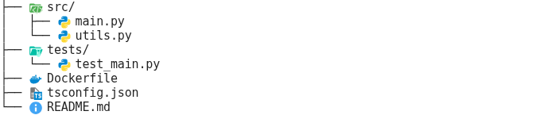
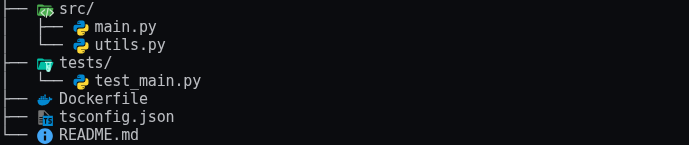

# mkdocs-treeview

A Python-Markdown extension and MkDocs plugin that renders ASCII file trees with
[Material icon theme](https://github.com/material-extensions/vscode-material-icon-theme) icons.
Works with MkDocs, Material for MkDocs, and Zensical.

Inspired by [asciidoctor-treeview](https://github.com/lask79/asciidoctor-treeview).

````markdown
```treeview
├── src/
│   ├── main.py
│   └── utils.py
├── tests/
│   └── test_main.py
├── Dockerfile
├── tsconfig.json
└── README.md
```
````

| Light | Dark |
|:---:|:---:|
|  |  |

---

## Features

- Renders ` ```treeview ` fenced code blocks as styled file trees
- Icons automatically chosen by file extension, file name, or folder name
- Supports ASCII-tree format (`tree` command output) and symbol-based (`*`/`#`) format
- Dynamic CSS — only icons actually used in your site are emitted (~7 KB instead of 1.3 MB)
- Dark/light mode: separate light-variant icons for `[data-md-color-scheme="slate"]`
- Three asset modes: `files` (local SVGs), `embedded` (base64 in CSS), `cdn` (jsDelivr)

---

## Installation

```bash
pip install mkdocs-treeview
```

---

## Usage

Write an ASCII tree in a fenced code block tagged `treeview`:

````markdown
```treeview
├── src/
│   ├── main.py
│   └── utils.py
├── tests/
│   └── test_main.py
├── Dockerfile
├── tsconfig.json
└── README.md
```
````

Both formats are accepted:

**ASCII-tree** (output of the `tree` command):
```
├── src/
│   └── main.py
└── README.md
```

**Symbol-based** (indent depth = number of markers):
```
* src/
** main.py
* README.md
```

---

## Configuration

### MkDocs (`mkdocs.yml`)

```yaml
plugins:
  - treeview:
      icon_mode: files   # files | embedded | cdn   (default: files)
```

The plugin registers the Markdown extension automatically and injects
`assets/treeview/treeview.css` into `extra_css`. No other configuration needed.

### Material for MkDocs (`mkdocs.yml`)

Identical to the MkDocs configuration — the plugin works with any MkDocs theme:

```yaml
theme:
  name: material

plugins:
  - treeview:
      icon_mode: embedded
```

### Zensical (`zensical.toml`)

Add the extension via `markdown_extensions` and point `extra_css` at the output file:

```toml
[project]
extra_css = ["stylesheets/treeview.css"]

[project.markdown_extensions."mkdocs_treeview.extension"]
css_output_path = "docs/stylesheets/treeview.css"
icon_mode = "embedded"
```

`css_output_path` is resolved relative to the directory where `zensical build` is
run (the project root). The extension writes a lean CSS file there after each page.

---

## Asset modes

| Mode | Behavior | Best for |
|---|---|---|
| `files` | SVGs copied to `assets/treeview/icons/`, CSS uses relative URLs | Production MkDocs sites |
| `embedded` | SVGs inlined as base64 data URIs — single self-contained CSS file | Zensical, offline output |
| `cdn` | CSS references jsDelivr URLs — no local files | Quick preview, GitHub rendering |

---

## How it works

The MkDocs plugin hooks into `on_config` to register the Markdown extension and
inject `extra_css`. During the build each page's treeview blocks are converted to
HTML with `tv-icon tv-icon-<name>` CSS classes. After the build, `on_post_build`
writes a lean CSS file containing only the icons that were actually rendered.

For Zensical, `TreeviewCSSPostprocessor` writes the CSS file after every page.
Because the extension object persists across all `render()` calls, the registry
accumulates icons across pages. The final write contains the complete lean CSS.

---

## HTML output

The renderer emits flat `<span class="tv-line">` rows with ASCII prefix connectors
(matching the asciidoctor-treeview approach), rather than a nested `<ul>/<li>` tree:

```html
<div class="treeview">
  <span class="tv-line">
    <span class="tv-line-prefix">├──&nbsp;</span>
    <span class="tv-line-element">
      <i class="tv-icon tv-icon-folder-src-open"></i>
      <span class="tv-item-name">src/</span>
    </span>
  </span>
  <span class="tv-line">
    <span class="tv-line-prefix">│&nbsp;&nbsp;&nbsp;├──&nbsp;</span>
    <span class="tv-line-element">
      <i class="tv-icon tv-icon-python"></i>
      <span class="tv-item-name">main.py</span>
    </span>
  </span>
  <span class="tv-line">
    <span class="tv-line-prefix">│&nbsp;&nbsp;&nbsp;└──&nbsp;</span>
    <span class="tv-line-element">
      <i class="tv-icon tv-icon-python"></i>
      <span class="tv-item-name">utils.py</span>
    </span>
  </span>
  <span class="tv-line">
    <span class="tv-line-prefix">└──&nbsp;</span>
    <span class="tv-line-element">
      <i class="tv-icon tv-icon-readme"></i>
      <span class="tv-item-name">README.md</span>
    </span>
  </span>
</div>
```

Folders with children use the open variant (`folder-src-open.svg`); leaf folders
use the closed variant. Unknown file types fall back to a generic file icon.

---

## Development

### Requirements

- Python >= 3.9
- [uv](https://docs.astral.sh/uv/) (recommended)
- Node.js / npm (only for `scripts/build_icons.py` — regenerating the icon bundle)

### Setup

```bash
uv sync
```

### Run tests

```bash
uv run pytest tests/unit/
uv run pytest tests/integration/
```

Integration tests build real demo sites into `tests/demos/` — inspect them in your
editor after a test run:

```
tests/demos/
  mkdocs/       MkDocs default theme
  material/     Material for MkDocs
  zensical/     Zensical
```

### Linting and type checking

```bash
uv run ruff format mkdocs_treeview/ tests/ scripts/
uv run ruff check mkdocs_treeview/ tests/ scripts/
uv run mypy mkdocs_treeview/
```

Pre-commit hooks run these automatically before every commit:

```bash
uv run pre-commit install   # once, after cloning
```

### Update icons

To update to a new version of `vscode-material-icon-theme`:

```bash
uv run python scripts/build_icons.py --version 5.x.y
```

Requires `npm` on PATH. Regenerates `mkdocs_treeview/icon_map.py` and
`mkdocs_treeview/icons/`. Commit the result.

---

## Publishing

### Build

```bash
uv build
```

Produces a wheel and sdist in `dist/`. Verify contents before publishing:

```bash
tar -tzf dist/*.tar.gz | sort
unzip -l dist/*.whl
```

### Bump version

Edit `version` in `pyproject.toml`, then tag the release:

```bash
git tag v0.2.0
```

### Publish to PyPI

```bash
UV_PUBLISH_TOKEN=pypi-... uv publish
```

---

## Credits and license

SVG icons from
[vscode-material-icon-theme](https://github.com/material-extensions/vscode-material-icon-theme)
by Philipp Kief and contributors — MIT license.

Rendering approach inspired by
[asciidoctor-treeview](https://github.com/lask79/asciidoctor-treeview)
by lask79 — MIT license.

This package is MIT licensed. See [LICENSE](LICENSE).
